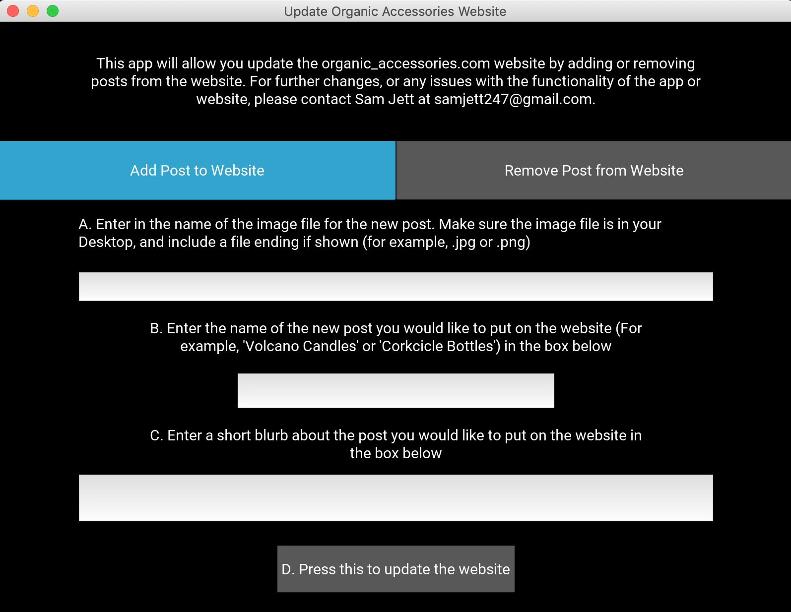
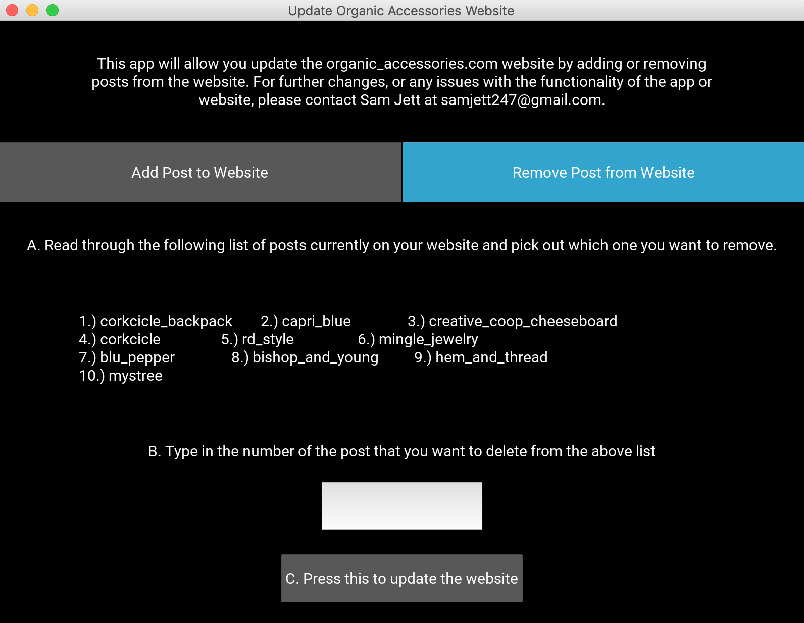

# organic_accessories_site
This is the repository to hold the website for my business, [Organic Accessories](organic-accessories.com). The main page of the site is shown below:

This repository also holds a GUI, developed using KIVY in Python, to allow easy modifications to the site. Some snapshots of the basic GUI are shown below. 

This shows the options and inputs for adding a new post to the website.

This shows the options and inputs for removing an existing post from the site.

The backend of the GUI program makes changes to the files and rebuilds the site, hopefully allowing the user to ensure the content on the site reflects the current offerings at Organic Accessories.
